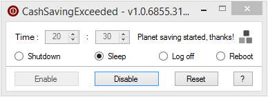

# CashSavingExceeded

## About
Windows tool to automatically shut down, reboot, log off or hibernate a computer **every day** at a specified time.

- Do your employees generally leave their computers on all the time?  
- Do you want to motivate them to participate actively in saving our planet?

:bulb: Well, give them the choice to shut down /sleep / hibernate their workstation at night!

## Features

- Every day, at a specified time:
  - Sleep computer
  - Hibernate computer
  - Reboot computer
  - Shut down computer
  - Log off user
- Whenever you want:
  - Enable / disable scheduled task
  - Restore default settings / values
  - Turn off screen(s) and lock session
- Start minimized in systray at Windows startup
- Fully portable, no rights / setup needed
- Can be fully controlled from systray
- User settings automatically saved
- No administrator rights needed
- Free, copyleft license
- Easter egg included

## Requirements
- Microsoft [.NET Framework 4](https://www.microsoft.com/en-US/download/details.aspx?id=17851)
- Microsoft Windows Vista or later

## Todo
- Localization
- Merge with [Zzz...](https://github.com/FoxP/Zzz...) (?)
- Final countdown before action
- Low CPU / bandwidth / user activity detection
  
## License
CashSavingExceeded is released under the [GNU General Public License v3.0](https://www.gnu.org/licenses/gpl-3.0.fr.html).
