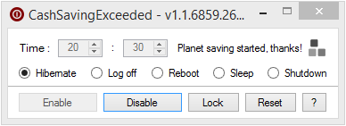

# CashSavingExceeded

## About
Windows tool to automatically shut down, reboot, log off or hibernate a computer **every day** at a specified time.

## Requirements
- Microsoft [.NET Framework 4](https://www.microsoft.com/en-US/download/details.aspx?id=17851)
- Microsoft Windows Vista or later

## Todo
- Localization
- Low CPU / bandwidth detection
  
## License
CashSavingExceeded is released under the [GNU General Public License v3.0](https://www.gnu.org/licenses/gpl-3.0.fr.html).
